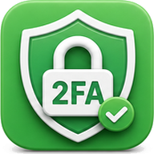
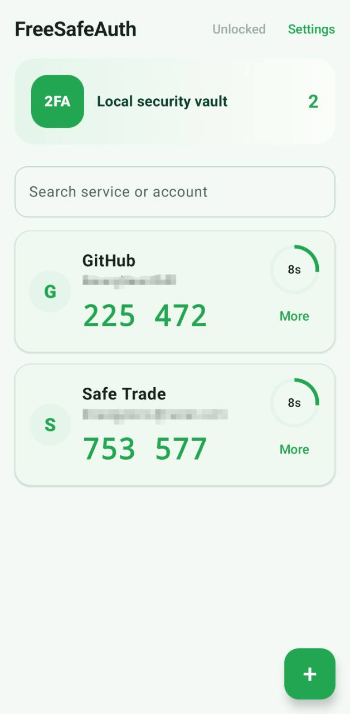
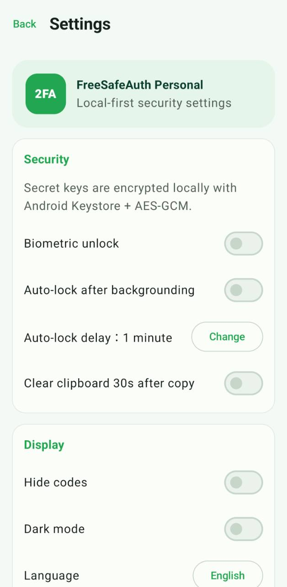

# Free SafeAuth Personal

**FreeSafeAuth Personal** is a local-only Android TOTP authenticator for personal 2FA codes. It is built for people who want a simple SafeAuth app with no ads, no analytics, no account login, and no server.

<p align="center">
  
</p>

<p align="center">
  
  
</p>

<p align="center">
  <a href="https://github.com/KwangYeonCHO/Free-SafeAuth-Personal/releases/latest">Download APK</a>
  ·
  <a href="#english">English</a>
  ·
  <a href="#中文">中文</a>
  ·
  <a href="#한국어">한국어</a>
</p>

## Why Free SafeAuth Personal

- **Local first**: TOTP codes are generated on device.
- **Private by default**: no network permission, no login, no cloud sync.
- **Encrypted secrets**: account secrets are protected with Android Keystore-backed AES-GCM.
- **Practical backup**: encrypted backup export/import with preview and duplicate detection.
- **Daily-use protection**: biometric unlock, auto-lock, clipboard clearing, and screenshot protection.
- **Multilingual UI**: follows system language or lets you choose Chinese, English, Japanese, or Korean.

## English

### Features

- Local TOTP verification code generation
- QR code scan for `otpauth://totp/...` links
- Manual account setup with Base32 secret validation
- 30-second countdown and automatic refresh
- Tap to copy verification codes
- Search accounts by service or account name
- Edit, delete, and reorder accounts
- Duplicate account detection
- Encrypted backup export and import
- Backup integrity check and import preview
- Biometric unlock and optional auto-lock after backgrounding
- One-time screenshot permission after biometric verification
- Optional clipboard clearing 30 seconds after copying
- Light and dark modes
- No ads, no analytics, no login, no server

### Privacy And Permissions

Free SafeAuth Personal is designed to work offline. The app does not request network permissions.

Requested permissions:

- `CAMERA`: scan TOTP QR codes.
- `USE_BIOMETRIC`: unlock the app and approve one-time screenshot permission.
- `READ_EXTERNAL_STORAGE`: import backup files on older Android versions.
- `WRITE_EXTERNAL_STORAGE`: export backup files on older Android versions.
- `MANAGE_EXTERNAL_STORAGE`: local backup file picker fallback on Android 11+.
- `DETECT_SCREEN_CAPTURE`: relock screenshots after a temporary one-time screenshot permission on Android 14+.

The merged debug manifest has been checked to ensure it does not include:

- `INTERNET`
- `ACCESS_NETWORK_STATE`

### Security Notes

- Secret keys are never stored as plain text.
- Database secrets are encrypted using Android Keystore-protected AES-GCM.
- Backup files are encrypted using `PBKDF2WithHmacSHA256 + AES-GCM`.
- Backup export writes an encrypted JSON file to the local Downloads folder.
- Lost backup passwords cannot be recovered.

### Build

Requirements:

- Android SDK
- JDK 17 available from `PATH` or `JAVA_HOME`
- Android Studio or the included Gradle Wrapper

Build a debug APK:

```bash
./gradlew assembleDebug
```

On Windows PowerShell:

```powershell
.\gradlew.bat assembleDebug
```

APK output:

```text
app/build/outputs/apk/debug/app-debug.apk
```

For production distribution, configure a proper release signing key and build a signed release APK or AAB.

## 中文

**Free SafeAuth Personal** 是一款面向个人使用的 Android 本地 TOTP 验证码工具。它专注于离线、安全和简洁：无广告、无统计、无登录、无服务器。

### 功能

- 本地生成 TOTP 动态验证码
- 扫描 `otpauth://totp/...` 二维码添加账号
- 手动输入 Secret Key，并校验 Base32 格式
- 30 秒倒计时和自动刷新
- 点击复制验证码
- 按服务名称或账号名称搜索
- 编辑、删除和排序账号
- 重复账号检测
- 加密备份导出和导入
- 备份完整性校验和导入预览
- 生物识别解锁和后台自动锁定
- 生物识别通过后临时允许截屏一次
- 可选复制后 30 秒自动清空剪贴板
- 浅色/深色模式
- 无广告、无统计、无登录、无服务器

### 隐私与权限

Free SafeAuth Personal 按离线工具设计，不申请网络权限。

当前权限：

- `CAMERA`：扫描 TOTP 二维码。
- `USE_BIOMETRIC`：解锁应用，以及批准一次性截屏授权。
- `READ_EXTERNAL_STORAGE`：旧版 Android 导入备份文件。
- `WRITE_EXTERNAL_STORAGE`：旧版 Android 导出备份文件。
- `MANAGE_EXTERNAL_STORAGE`：Android 11+ 本地备份文件选择兜底。
- `DETECT_SCREEN_CAPTURE`：Android 14+ 临时允许一次截屏后重新锁定截屏。

已检查合并后的 Debug Manifest，确认不包含：

- `INTERNET`
- `ACCESS_NETWORK_STATE`

### 安全说明

- Secret Key 不会明文保存。
- 数据库中的密钥使用 Android Keystore 保护的 AES-GCM 加密。
- 备份文件使用 `PBKDF2WithHmacSHA256 + AES-GCM` 加密。
- 导出备份会将加密 JSON 文件保存到本机下载目录。
- 备份密码丢失后无法恢复备份内容。

### 构建

依赖环境：

- Android SDK
- JDK 17，并已配置到 `PATH` 或 `JAVA_HOME`
- Android Studio 或项目内置 Gradle Wrapper

构建 Debug APK：

```bash
./gradlew assembleDebug
```

Windows PowerShell：

```powershell
.\gradlew.bat assembleDebug
```

APK 输出位置：

```text
app/build/outputs/apk/debug/app-debug.apk
```

如需正式分发，请配置正式签名密钥，并构建签名 Release APK 或 AAB。

## 한국어

**Free SafeAuth Personal**은 개인 사용을 위한 Android 로컬 TOTP 인증 앱입니다. 오프라인, 보안, 단순함에 집중하며 광고, 통계, 로그인, 서버가 없습니다.

### 기능

- 로컬 TOTP 인증 코드 생성
- `otpauth://totp/...` QR 코드 스캔으로 계정 추가
- Base32 Secret Key 직접 입력 및 형식 검증
- 30초 카운트다운 및 자동 갱신
- 인증 코드 복사
- 서비스 이름 또는 계정 이름으로 검색
- 계정 편집, 삭제, 정렬
- 중복 계정 감지
- 암호화 백업 내보내기 및 가져오기
- 백업 무결성 검사 및 가져오기 미리보기
- 생체 인식 잠금 해제 및 백그라운드 전환 후 자동 잠금
- 생체 인증 후 임시 1회 스크린샷 허용
- 복사 후 30초 뒤 클립보드 자동 삭제 옵션
- 라이트/다크 모드
- 광고 없음, 통계 없음, 로그인 없음, 서버 없음

### 개인정보 및 권한

Free SafeAuth Personal은 오프라인 도구로 설계되었으며 네트워크 권한을 요청하지 않습니다.

요청 권한:

- `CAMERA`: TOTP QR 코드 스캔.
- `USE_BIOMETRIC`: 앱 잠금 해제 및 1회 스크린샷 허용 승인.
- `READ_EXTERNAL_STORAGE`: 이전 Android 버전에서 백업 파일 가져오기.
- `WRITE_EXTERNAL_STORAGE`: 이전 Android 버전에서 백업 파일 내보내기.
- `MANAGE_EXTERNAL_STORAGE`: Android 11+에서 로컬 백업 파일 선택 대체 기능.
- `DETECT_SCREEN_CAPTURE`: Android 14+에서 임시 1회 스크린샷 허용 후 다시 잠금.

병합된 Debug Manifest를 확인했으며 다음 권한은 포함되어 있지 않습니다.

- `INTERNET`
- `ACCESS_NETWORK_STATE`

### 보안 안내

- Secret Key는 평문으로 저장되지 않습니다.
- 데이터베이스의 Secret Key는 Android Keystore로 보호되는 AES-GCM으로 암호화됩니다.
- 백업 파일은 `PBKDF2WithHmacSHA256 + AES-GCM`으로 암호화됩니다.
- 백업 내보내기는 암호화된 JSON 파일을 로컬 다운로드 폴더에 저장합니다.
- 백업 비밀번호를 잃어버리면 백업 내용을 복구할 수 없습니다.

### 빌드

필요 환경:

- Android SDK
- `PATH` 또는 `JAVA_HOME`에 설정된 JDK 17
- Android Studio 또는 포함된 Gradle Wrapper

Debug APK 빌드:

```bash
./gradlew assembleDebug
```

Windows PowerShell:

```powershell
.\gradlew.bat assembleDebug
```

APK 출력 위치:

```text
app/build/outputs/apk/debug/app-debug.apk
```

실제 배포를 위해서는 정식 서명 키를 설정하고 서명된 Release APK 또는 AAB를 빌드하세요.

## License

This project is released under the MIT License. See [LICENSE](LICENSE).
